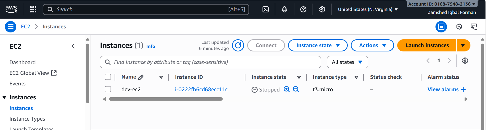
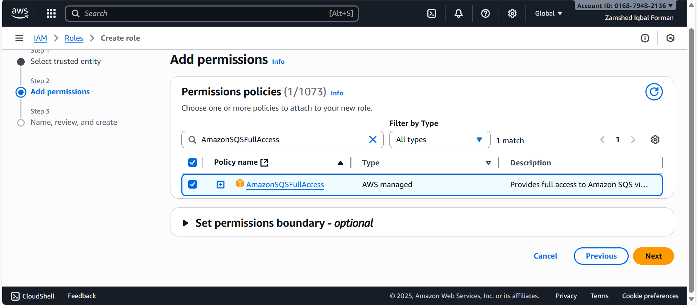
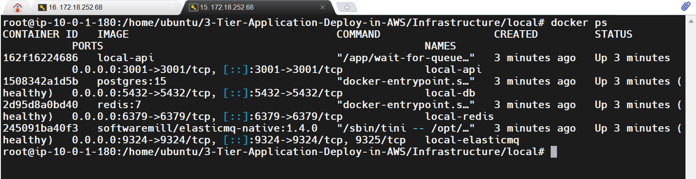

# 3-Tier Todo Application Deployment on AWS

This repository contains instructions to deploy the complete Todo application to AWS using EC2, Docker, and CloudFront. The application consists of:

- Backend API service
- Worker service
- PostgreSQL database
- Redis
- ElasticMQ (for local testing)
- React frontend

---

## Prerequisites

- AWS CLI installed and configured
- Terraform installed
- Docker & Docker Compose installed
- SSH access to EC2 instance

---

## Step 1: Check Free Tier EC2 Instance Types



Run the following command to list free-tier eligible EC2 instance types in the `us-east-1` region:

```bash
aws ec2 describe-instance-types   --filters Name=free-tier-eligible,Values=true   --region us-east-1   --query "InstanceTypes[].InstanceType"   --output table
```

---

## Step 2: SSH Access to EC2



1. Set the correct permissions for your private key:

```bash
chmod 400 $(terraform output -raw ec2_private_key_path)
```

2. SSH into your EC2 instance:

```bash
ssh -i $(terraform output -raw ec2_private_key_path) ubuntu@$(terraform output -raw ec2_public_ip)
```

---

## Step 3: Docker Login for ECR

1. Retrieve your ECR repository URL:

```bash
terraform output ecr_repository_url
```

2. Login to ECR:

```bash
aws ecr get-login-password --region us-east-1 | docker login --username AWS --password-stdin <YOUR_ECR_REPOSITORY_URL>
```

---

## Step 4: Transfer Project Files to EC2

Use `scp` or `rsync` to copy your project folder to the EC2 instance:

### Option 1: rsync (recommended)

```bash
rsync -avz -e "ssh -i /path/to/ec2_key.pem"     /path/to/local/3-Tier-Application-Deploy-in-AWS     ubuntu@<EC2_PUBLIC_IP>:/home/ubuntu/
```

### Option 2: scp (no exclude support)

```bash
scp -i /path/to/ec2_key.pem -r     /path/to/local/3-Tier-Application-Deploy-in-AWS     ubuntu@<EC2_PUBLIC_IP>:/home/ubuntu/
```

---

## Step 5: Build and Start Docker Containers

Navigate to the `local` folder in your EC2 instance:

```bash
cd ~/3-Tier-Application-Deploy-in-AWS/Infrastructure/local
```

Rebuild and start the containers:



```bash
docker compose --env-file .env.local up --build
```

---

## Step 6: Setup ElasticMQ Queues

ElasticMQ does not auto-create queues. Run the following commands to create them:

```bash
aws --endpoint-url=http://localhost:9324 sqs create-queue --queue-name todo-queue
aws --endpoint-url=http://localhost:9324 sqs create-queue --queue-name todo-dlq
```

---

## Step 7: Frontend Deployment

- Deploy the React frontend to an S3 bucket.
- Configure CloudFront distribution pointing to the S3 bucket.
- Update frontend API requests to use the public IP of the EC2 backend.

---

## Step 8: Verification

1. Access the backend API via EC2 public IP:

```
http://<EC2_PUBLIC_IP>:<API_PORT>
```

2. Access the frontend via CloudFront URL:

```
https://<CLOUDFRONT_DISTRIBUTION_URL>
```

3. Test the full application functionality (create, update, delete todos).

---

## Step 9: Notes

- Ensure your `.env.local` file contains all necessary environment variables.
- Make sure EC2 security groups allow traffic on required ports:
  - 80/443 for frontend
  - 5432 for PostgreSQL
  - 6379 for Redis
  - 9324-9325 for ElasticMQ (if testing locally)
- For zero-downtime deployment (bonus), use rolling container updates.

---

**End of Deployment Guide**

